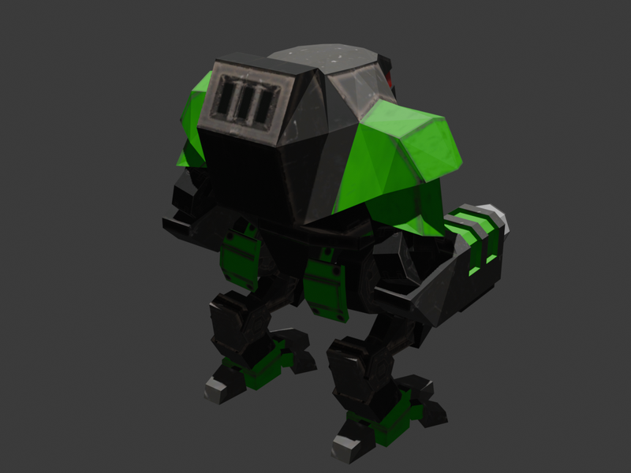
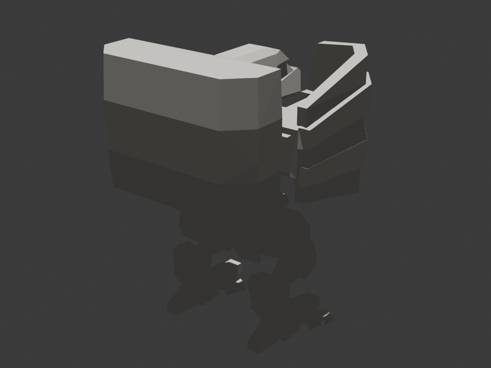
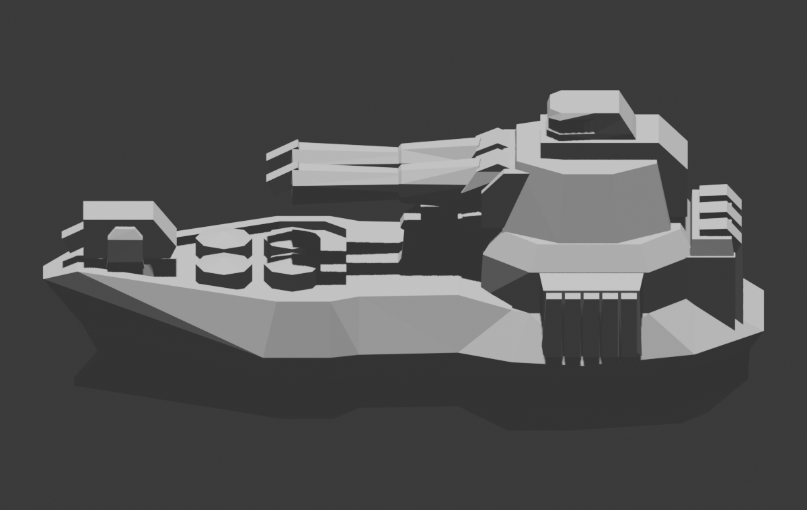
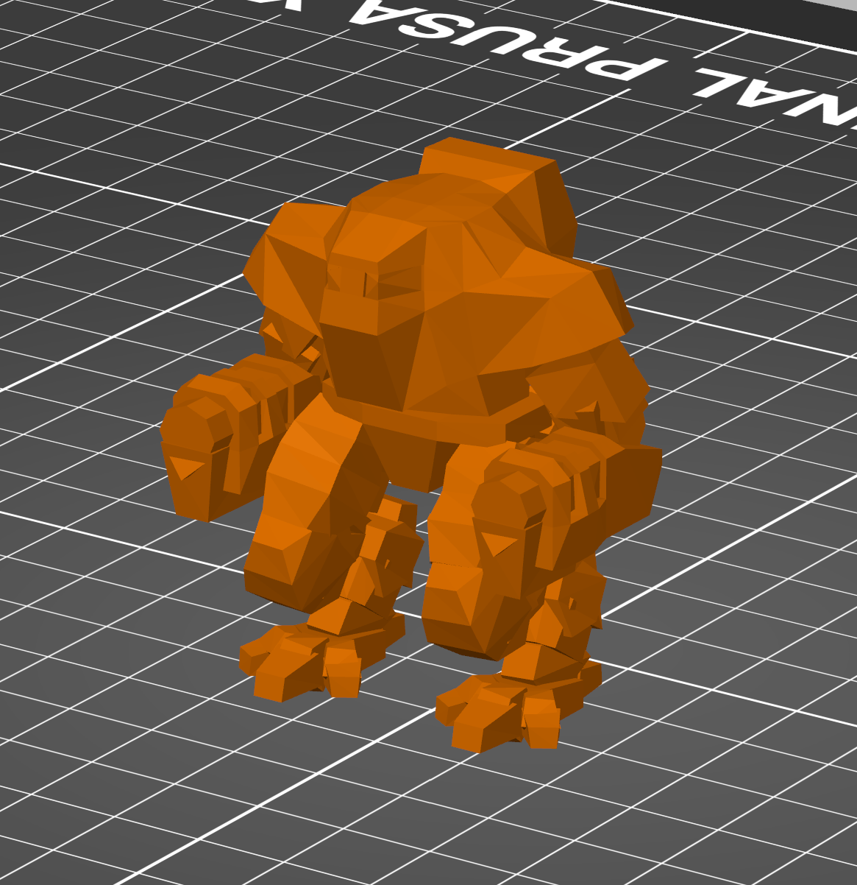

# barprint

`barprint` turns Beyond All Reason unit models into local 3D-print files. It finds BAR units, imports their S3O models through Blender, repairs common game-mesh issues, scales the model, and writes STL or 3MF output that you can open in slicer software.

The tool runs on your computer. It does not upload BAR assets or generated models.

## Examples

These sample renders are untextured captures of final STL output from `barprint`.

| CORAK bot | CORPYRO heavy bot | CORROY destroyer |
| --- | --- | --- |
|  |  |  |

Slicer preview of the default CORAK STL:



## Quickstart

Requirements: Windows PowerShell, Python 3.10 or newer, Blender, and an installed Beyond All Reason data directory.

```powershell
git clone https://github.com/ben900256-source/bar-3d-prints.git
cd bar-3d-prints
python -m pip install .
barprint configure --user
barprint list-units --faction cortex --type bot
barprint export --unit corak --open
```

`configure --user` looks for Blender and BAR data, then saves the paths for later commands. If the BAR data path is not found automatically, it asks you to paste the path.

`list-units --faction cortex --type bot` prints a long table that begins like this:

```text
                                                                                    Cortex (55)
+----------------------------------------------------------------------------------------------------------------------------------------------------------------------------------+
| Code           | Name                         | Description                                | Kind     | Type                         | Source                                    |
|----------------+------------------------------+--------------------------------------------+----------+------------------------------+-------------------------------------------|
| coraak         | Manticore                    | Heavy Amphibious Anti-Air Bot              | unit     | Bot                          | objects3d/units/coraak.s3o                |
| corack         | Advanced Construction Bot    | Tech 2 Constructor                         | unit     | Bot                          | objects3d/units/corack.s3o                |
| corak          | Grunt                        | Fast Infantry Bot                          | unit     | Bot                          | objects3d/units/corak.s3o                 |
| corakt4        | Epic Grunt                   | Fast Amphibious Infantry Bot               | unit     | Bot                          | objects3d/units/scavboss/corakt4.s3o      |
| coralab        | Advanced Bot Lab             | Produces Tech 2 Bots                       | building | Bot                          | objects3d/units/coralab.s3o               |
...
```

Use the `Code` column with `barprint export`. In the example above, the code is `corak`.

Useful listing commands:

```powershell
barprint list-units
barprint list-units --by-faction
barprint list-units --group-by kind
barprint list-units --group-by type
barprint list-units --group-by factory --kind unit
barprint list-units --faction cortex --type naval
barprint info --unit corak
```

After the export, expect the final STL:

```text
out/corak/corak.stl
```

When `--out` is omitted, exports are written to `out\<unit>\<unit>.<format>`.

Use `--open` to launch the exported file in your default slicer or STL app when the export finishes:

```powershell
barprint export --unit corak --open
barprint export --unit corpyro --open
barprint export --unit corroy --open
barprint export --unit corroy --format 3mf --open
barprint export --unit corak --export-support-files --open
barprint export --unit corak --out .\custom-output\corak.stl --open
```

If you want the manifest JSON and normalized print-source GLB for debugging or audit trails, add `--export-support-files`.

## More Docs

- [Usage](docs/usage.md): install details, BAR data paths, configuration modes, setup checks, listing units, exporting, and common failures.
- [Advanced](docs/advanced.md): poses, variants, scaling, bases, STL/3MF options, debug-stage output, manifests, explicit S3O paths, and printability tuning.
- [Development](docs/development.md): editable installs, tests, export audits, release checks, and contribution guidance.

## Troubleshooting

Run this first when setup or export fails:

```powershell
barprint doctor
```

Common fixes are installing Blender, running `barprint configure --user` again, checking the BAR data path, or using a unit code from `barprint list-units`.

## License

This repository's code and documentation are source-available under the PolyForm Noncommercial License 1.0.0. Commercial use requires separate permission from the copyright holders.

This repository does not grant rights to Beyond All Reason game assets, models, textures, names, trademarks, or generated derivatives. Use BAR assets only in ways allowed by their licenses and terms.
