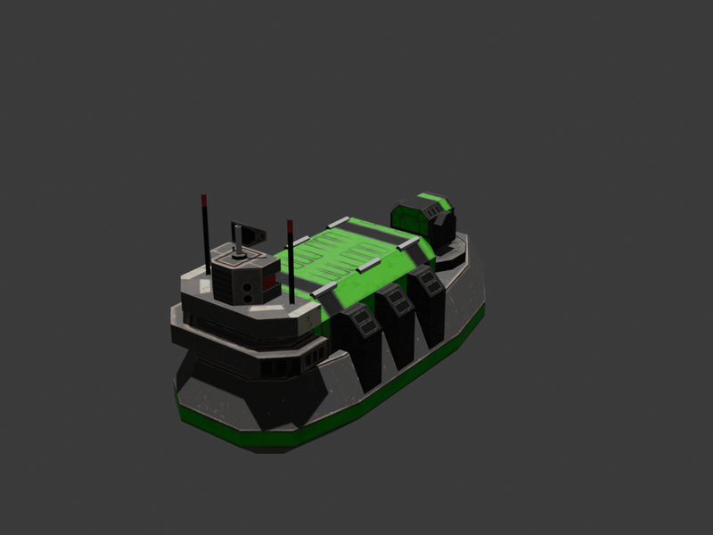

# barprint

`barprint` is a local command-line pipeline for converting Beyond All Reason unit S3O models into printable STL or 3MF files through headless Blender. Normal exports do not require opening Blender manually.

## Why

Beyond All Reason has a large set of distinctive unit models, but those models are built for a realtime game engine rather than 3D printing. A direct mesh export often needs manual importer setup, pose work, scaling, axis fixes, split-vertex cleanup, thin-feature thickening, and mesh repair before it has a reasonable chance of printing cleanly.

`barprint` packages that conversion into a repeatable local workflow. It discovers BAR units, imports S3O models through Blender, applies automatic pose profiles, normalizes scale, repairs common mesh issues, and exports printable STL or 3MF files with manifests and debug views. The goal is to make personal model preparation consistent enough that users can spend their time choosing units and tuning prints instead of rebuilding the same export pipeline by hand.

The tool runs locally and does not upload BAR assets or generated models. It is a conversion aid only; users are still responsible for following BAR's asset licenses and terms.

## Quickstart

Requirements: Python 3.10+, Blender, and an installed Beyond All Reason data directory.

```powershell
git clone https://github.com/ben900256-source/bar-3d-prints.git
cd bar-3d-prints
python -m pip install .
barprint configure --user
barprint doctor
barprint list-units --faction cortex
barprint export --unit corak --pose all --debug-stages --out .\out\corak
barprint view .\out\corak\corak_debug
```

`configure --user` asks for the local BAR data path if it cannot discover one, finds Blender when it is installed in the standard location, and installs the S3O importer into user data. `list-units --faction cortex` shows available Cortex unit codes such as `corak`, which can then be passed to `export`. The export command writes printable STL files, a normalized GLB print source, manifests, debug-stage captures, and a browser viewer.

For a self-contained workspace that avoids user-level config, use:

```powershell
python -m barprint configure --portable .\barprint-portable
$env:BARPRINT_PORTABLE_HOME = ".\barprint-portable"
python -m barprint doctor
```

## Sample Captures

These are generated debug-stage captures from `barprint` exports after the final STL is reimported into Blender. They show the printable geometry without source textures.

| CORAK bot | CORPYRO heavy bot | CORMSHIP naval unit |
| --- | --- | --- |
|  |  |  |

## Install

From a release wheel:

```powershell
python -m pip install .\dist\barprint-0.1.0-py3-none-any.whl
barprint configure --user
barprint doctor
```

From a source checkout:

```powershell
python -m pip install .
barprint configure --user
barprint doctor
```

For development from this repository:

```powershell
python -m pip install -e ".[dev]"
python -m barprint configure --local
python -m barprint doctor
```

Install Blender separately from <https://www.blender.org/download/>. The CLI auto-detects the standard Windows installer layout under `C:\Program Files\Blender Foundation\Blender <version>\blender.exe`. If Blender is somewhere else, pass `--blender`, set `BLENDER_EXE`, or save it with `configure`.

For a portable workspace, keep config, the S3O importer, and generated cache files under one folder:

```powershell
python -m barprint configure --portable C:\tools\barprint-portable
$env:BARPRINT_PORTABLE_HOME = "C:\tools\barprint-portable"
python -m barprint doctor
```

The `$env:BARPRINT_PORTABLE_HOME` assignment above is session-local in PowerShell. For later sessions, either run commands from `C:\tools\barprint-portable`, set `BARPRINT_PORTABLE_HOME` persistently, or pass `--config C:\tools\barprint-portable\barprint.portable.json`.

This project has no npm dependency. The optional debug viewer is generated as static HTML with an embedded WebGL runtime and can be served with `barprint view`.

## S3O Importer

Blender does not import Spring/BAR `.s3o` files by default. `configure` installs the FluidPlay `s3o-Blender-plugins-2022` importer automatically when no importer is configured or discovered. The destination follows the selected config scope: repo-local `vendor/` for `--local`, per-user data for `--user`, or the portable folder for `--portable`. You can also pass a compatible importer explicitly:

```powershell
python -m barprint export --s3o .\BAR.sdd\objects3d\Units\CORAK.s3o --s3o-importer .\vendor\s3o-Blender-plugins-2022\s3o_import.py --out .\out\corak
```

You can also place the importer under `vendor/s3o-Blender-plugins-2022/s3o_import.py`, `vendor/s3o_import.py`, or `barprint/vendor/s3o_import.py`; the CLI checks those repo-local paths automatically. It also checks per-user and active portable vendor paths. If `export` or `inspect --with-pieces` runs interactively and no importer is available, it offers to install the default FluidPlay importer. For other locations, pass `--s3o-importer` or set `s3o_importer` in config so failures are explicit and reproducible.

## Configuration

Paths can live in config instead of repeated command arguments. Use one of:

```powershell
barprint configure --user
python -m barprint configure --local
python -m barprint configure --portable C:\tools\barprint-portable
```

You can also copy `barprint.config.example.json` to `barprint.local.json` and fill in the paths for your machine:

```json
{
  "bar_root": "C:/Users/<you>/AppData/Local/Programs/Beyond-All-Reason/data/games/BAR.sdd",
  "blender": "C:/Program Files/Blender Foundation/Blender <version>/blender.exe",
  "s3o_importer": "C:/path/to/s3o_import.py",
  "scale_reference_unit": "armcom",
  "scale_reference_height_mm": 45,
  "test_s3o_path": "C:/path/to/model.s3o"
}
```

Config discovery order is `--config`, `BARPRINT_CONFIG`, `./barprint.local.json`, active portable config, then per-user config. Portable config is active when `BARPRINT_PORTABLE_HOME` points to a folder containing `barprint.portable.json`, or when the current directory contains `barprint.portable.json`. Command-line arguments override config values.

## BAR Data

BAR install data is commonly under:

```text
C:\Users\<user>\AppData\Local\Programs\Beyond-All-Reason\data
C:\Program Files\Beyond-All-Reason\data
```

The game data root used by this tool is usually:

```text
C:\Users\<user>\AppData\Local\Programs\Beyond-All-Reason\data\games\BAR.sdd
```

Unit Lua files live under `BAR.sdd/units/**/*.lua` and typically contain an `objectname`, for example `objectname = "Units/CORAK.s3o"`. The model is resolved as `BAR.sdd/objects3d/Units/CORAK.s3o`.

The Windows launcher may store game content as rapid `.sdp` packages under `data\packages` plus compressed files under `data\pool` instead of an unpacked `BAR.sdd`. `barprint` can read that installed rapid layout for unit discovery and extracts individual S3O files only when needed for export. Repo-local config uses `.barprint-cache`, portable config uses the portable folder's `cache/` directory, and installed/user config uses the OS user cache directory. Set `BARPRINT_CACHE_DIR` to force another cache location.

## Commands

Check setup:

```powershell
barprint doctor
barprint doctor --json
```

List units:

```powershell
python -m barprint list-units --bar-root "C:\Users\<user>\AppData\Local\Programs\Beyond-All-Reason\data\games\BAR.sdd"
# or, with barprint.local.json configured:
python -m barprint list-units
```

List units grouped by faction, or only one faction:

```powershell
python -m barprint list-units --by-faction
python -m barprint list-units --group-by kind
python -m barprint list-units --group-by type
python -m barprint list-units --group-by factory --kind unit
python -m barprint list-units --faction armada
python -m barprint list-units --faction scavs
python -m barprint list-units --faction raptors
python -m barprint list-units --faction armada --kind unit --with-icons
python -m barprint list-units --faction armada --type bot
python -m barprint list-units --type experimental
python -m barprint info --unit armflea --with-icon
```

`list-units` includes human-readable names, descriptions, faction, kind, type, and model path. Use `--kind {all,unit,building,other}` to narrow by asset kind, `--type {all,bot,aircraft,naval,vehicle,experimental}` to narrow by overlapping unit type tags, `--group-by {none,faction,kind,type,factory}` to change grouping, and `--with-icons --icon-size 16` for terminal-rendered color thumbnails.

Export all automatically selected poses for CORAK:

```powershell
python -m barprint export `
  --bar-root "C:\Users\<user>\AppData\Local\Programs\Beyond-All-Reason\data\games\BAR.sdd" `
  --unit corak `
  --pose all `
  --out .\out\corak `
  --s3o-importer .\vendor\s3o-Blender-plugins-2022\s3o_import.py
```

With `barprint.local.json` configured, the same export can omit the per-user paths:

```powershell
python -m barprint export `
  --unit corak `
  --pose all `
  --out .\out\corak
```

Export an alternate print variant when the selected pose profile defines one:

```powershell
python -m barprint export `
  --unit armcom `
  --variant decorated `
  --out .\out\armcom
```

The default `bot_small` profile exports the Armada commander without its optional crown/medal decorations. Use `--variant decorated` to include a repositioned crown and medal when those pieces exist; use `--variant all` to export every variant.

If you omit both `--unit` and `--s3o` in an interactive terminal, `export` prompts for a faction and unit, then generates the selected model. When `--out` is omitted, output defaults to `out/<unit>/<unit>.<format>` for one pose, `out/<unit>/<unit>_<pose>.<format>` for multiple poses, and adds a variant suffix such as `<unit>_decorated.stl` when a non-standard variant is selected.
The interactive unit selector shows the same names, descriptions, and terminal thumbnails; pass `--no-selector-icons` to use text-only selection.

```powershell
python -m barprint export `
  --unit armflea `
  --pose-profile .\barprint\profiles\tick.json `
  --pose neutral
```

You can still override the automatic profile selection explicitly. For example, force the tick profile:

```powershell
python -m barprint export `
  --unit armflea `
  --pose-profile .\barprint\profiles\tick.json `
  --pose all `
  --out .\out\tick
```

Export from an explicit S3O:

```powershell
python -m barprint export `
  --s3o ".\BAR.sdd\objects3d\Units\CORAK.s3o" `
  --pose-profile .\barprint\profiles\bot_small.json `
  --pose neutral `
  --out .\out\corak.stl `
  --s3o-importer .\vendor\s3o-Blender-plugins-2022\s3o_import.py
```

Inspect imported pieces as JSON:

```powershell
python -m barprint inspect --s3o .\model.s3o --with-pieces --s3o-importer .\vendor\s3o-Blender-plugins-2022\s3o_import.py
```

Printable STL/3MF exports are generated from a normalized opaque GLB print source. The pipeline imports and poses the S3O, forces print-source materials to opaque beige, writes a `*_print_source.glb` next to the output, reloads that GLB, welds and caps mesh boundary loops, automatically rebuilds closed residual non-manifold pieces as convex hulls when needed, then applies print thickening, base settings, and final STL/3MF export.

## Profiles

Pose profiles live in `barprint/profiles`. BAR models are piece hierarchies rather than skinned characters, so posing rotates named mesh or empty pieces around their existing pivots. Matching is case-insensitive and prefers exact name, then prefix, then substring.

When `--pose-profile` is omitted, `export --unit ...` chooses a built-in profile from BAR metadata and S3O piece names. Current automatic archetypes cover small bots, large/experimental bots, tick/flea scouts, vehicles, turrets, buildings, and raptors. The standard biped/tick-style `--pose all` set is `neutral`, `aim_left`, `aim_right`, `stride_left`, `stride_right`, `brace`, and `advance`; vehicle and turret/building profiles use smaller weapon/platform-specific pose sets.

Useful options:

```text
--pose all
--random-poses 5
--variant decorated
--variant all
--scale-mm 45
--scale-mode game-relative
--scale-reference-unit armcom
--scale-reference-height-mm 45
--base / --no-base
--base-diameter-mm 32
--base-height-mm 2.4
--min-feature-mm 0.8
--thin-feature-max-inflate-mm 0.4
--no-thin-features
--format stl
--format 3mf
--keep-raw
--debug-stages
```

## Output

Batch output with `--out .\out\corak --pose all` creates files like:

```text
out/corak/corak_neutral.stl
out/corak/corak_aim_left.stl
out/corak/corak_aim_right.stl
out/corak/corak_stride_left.stl
out/corak/corak_stride_right.stl
out/corak/corak_neutral_manifest.json
```

The manifest records the source S3O, pose, pose profile name/archetype/source, scale, mesh closure, thin feature thickening, base settings, warnings, and Blender version.

Pass `--debug-stages` to write an opt-in `<output>_debug` folder next to the export. It contains A-I stage renders plus G2 mesh-closure renders, GLB/STL snapshots, `stage_report.json`, and a standalone debug viewer HTML file: `<output>_debug_viewer.html`.

Open a debug viewer through a local HTTP server:

```powershell
barprint view .\out\armcom\armcom_debug
barprint view .\out\armcom\armcom_debug\armcom_debug_viewer.html
```

`barprint view` serves the containing folder so GLB/STL assets load correctly in browsers that block `file://` model fetches. The viewer is self-contained HTML with an embedded WebGL STL/GLB renderer; it does not require npm or a CDN.

Profiles default to no round base. Pass `--base` when you want the pipeline to add one.

Profiles default to game-relative scale: the Armada commander (`armcom`) is exported at `45mm` tall, and every other unit is scaled by the same source-to-mm ratio. Override this with `--scale-reference-unit` and `--scale-reference-height-mm`, or set `scale_reference_unit` and `scale_reference_height_mm` in `barprint.local.json`. Use `scale_reference_unit: "tallest"` if you want the older tallest-unit reference behavior, or pass `--scale-mm` for an absolute target height for only the current model.

## Printability Notes

BAR models are game meshes. They may have very thin barrels, floating pieces, holes, or details that do not survive FDM printing. `barprint` preserves the joined imported geometry. Before export, it probes local mesh thickness and expands regions thinner than `--min-feature-mm` so pipes and struts are thickened instead of simply disappearing. Tune that with `--min-feature-mm`, cap growth with `--thin-feature-max-inflate-mm`, or disable it with `--no-thin-features`.

Use BAR assets only in ways allowed by their licenses and the BAR project's terms. This project does not grant rights to BAR game assets, S3O models, textures, names, trademarks, or generated derivatives.

## License

This repository's code and documentation are source-available under the PolyForm Noncommercial License 1.0.0. Commercial use requires separate permission from the copyright holders.

The license covers this repository only. It does not grant rights to Beyond All Reason game assets, models, textures, names, trademarks, or generated derivatives.

## Troubleshooting

`Blender not found`: Install Blender, set `BLENDER_EXE`, or pass `--blender "C:\Program Files\Blender Foundation\Blender <version>\blender.exe"`.

`S3O importer missing`: Run `barprint configure --user`, `python -m barprint configure --local`, or pass `--s3o-importer` with a compatible importer `.py` or add-on `.zip`.

`Failed to load ... Failed to fetch` in a debug viewer: Open the viewer with `barprint view <debug-folder-or-viewer.html>` instead of opening the HTML through `file://`.

`S3O import operator not registered`: The importer loaded but did not register `bpy.ops.import_scene.s3o` or `bpy.ops.import_mesh.s3o`. Try a different importer version or Blender version.

`Unit not found`: Check `--bar-root`, run `list-units --by-faction`, and use the Lua filename stem such as `corak` or `armflea`.

`Model imported but no meshes found`: The importer may not support that file, or the import failed without raising a clear Blender error.

## Tests

```powershell
python -m pytest --basetemp tmp\pytest-release -p no:cacheprovider
```

Optional Blender integration test:

```powershell
python -m pytest tests\test_integration_blender.py --basetemp tmp\pytest-release-integration -p no:cacheprovider
```

The integration test reads `BLENDER_EXE`, `TEST_S3O_PATH`, and `S3O_IMPORTER_PATH`, or the `blender`, `test_s3o_path`, and `s3o_importer` values from local config. If `test_s3o_path` is omitted, it derives a representative model from configured BAR data using `scale_reference_unit`, falling back to `armcom`.

Optional all-unit export audit:

```powershell
$env:BARPRINT_EXPORT_AUDIT = "1"
python -m pytest tests\test_export_audit.py --basetemp tmp\barprint-release-full-audit -p no:cacheprovider
```

The audit exports every discovered unit through the normal automatic pose-profile, opaque print-source STL path, validates final STL bounds and strict topology, then writes per-unit metrics and debug-stage artifacts for failures. Set `BARPRINT_EXPORT_AUDIT_UNITS="armcom,corak"` to run a focused subset.

## Release Checklist

Before tagging or publishing a release:

```powershell
python -m pytest --basetemp tmp\pytest-release -p no:cacheprovider
python -m pytest tests\test_integration_blender.py --basetemp tmp\pytest-release-integration -p no:cacheprovider
$env:BARPRINT_EXPORT_AUDIT = "1"
python -m pytest tests\test_export_audit.py --basetemp tmp\barprint-release-full-audit -p no:cacheprovider
python -m build --sdist --wheel --outdir tmp\dist-release
```

Keep generated audit and build artifacts under `tmp/`; they are intentionally ignored by git.
